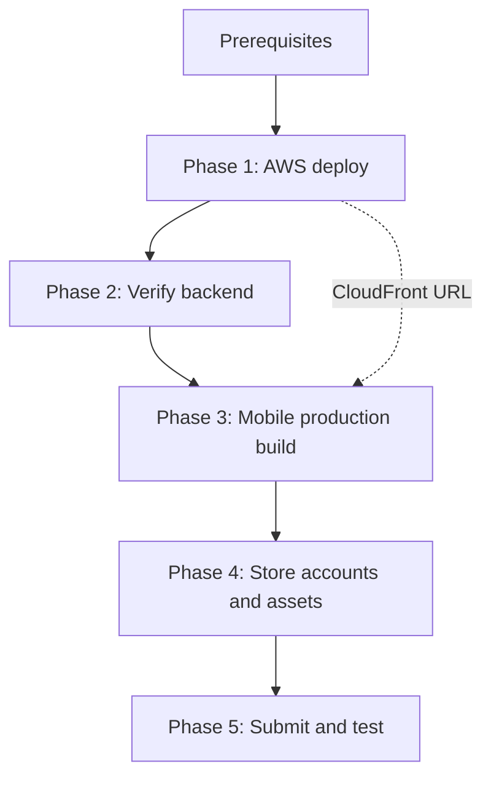

# Deploy backend (AWS) and publish mobile (Android / iOS)

End-to-end guide for RYDO: run the API and web UI on AWS, then ship the **same React app** in Capacitor shells to Google Play and the App Store.

| Piece | What it is | Where |
|-------|------------|--------|
| Backend + web | Docker image → ECS Fargate, HTTPS via CloudFront | [`infra/`](../infra/), [`scripts/deploy-aws.sh`](../scripts/deploy-aws.sh) |
| Mobile | Vite build → Capacitor → native project | [`mobile/`](../mobile/) |

**Short answer:** Yes — treat **AWS deploy as phase 1** and **store builds as phase 2**. The mobile app must call your **live HTTPS API** (the CloudFront URL from deploy). Store submission is separate from AWS and is not automated by `deploy-aws.sh` today.

---

## Overview (sequence)



| Phase | Goal | Who / where |
|-------|------|-------------|
| 0 | Accounts, tokens, tooling | You (once) |
| 1 | API + web live on HTTPS | `bash scripts/deploy-aws.sh` |
| 2 | Login, maps, live ride / hubs work against CloudFront | Browser + optional device |
| 3 | Bundle app with `VITE_API_BASE_URL=<CloudFront>` | `mobile/` (Windows OK for Android) |
| 4 | Play Console / App Store Connect metadata | You |
| 5 | Internal testing → production | Google / Apple |

Re-deploying AWS (new image, same stack) does **not** require a new store build unless you change native code, Capacitor plugins, or env vars baked into the JS bundle (e.g. API URL, Mapbox token).

---

## Phase 0 — Prerequisites (one-time)

### AWS

- [AWS CLI](https://aws.amazon.com/cli/) configured (`aws sts get-caller-identity`)
- Docker
- Node/npm (for CDK in `infra/`)
- Bash (Git Bash / WSL / macOS / Linux) for [`scripts/deploy-aws.sh`](../scripts/deploy-aws.sh)

Optional: copy [`infra/deploy.env.example`](../infra/deploy.env.example) → `infra/deploy.env` (region, profile, Mapbox token for the **Docker web build**).

Details: [`infra/README.md`](../infra/README.md).

### Mobile dev (local / emulator)

- **Android:** Android Studio, JDK 21+, `JAVA_HOME`, `ANDROID_HOME` — see [`mobile/README.md`](../mobile/README.md)
- **iOS:** Mac + Xcode only (not on Windows)
- Mapbox token in `client/.env.local` (used when building mobile)

### Store publishing (separate from AWS)

| Platform | Account | Typical cost |
|----------|---------|----------------|
| Google Play | [Play Console](https://play.google.com/console) | One-time ~$25 |
| Apple App Store | [Apple Developer Program](https://developer.apple.com/programs/) | ~$99/year |

You also need: **privacy policy URL**, support contact, store screenshots, and honest **data safety / privacy** declarations (location is used for live ride).

### App identity

Capacitor config today:

- **App ID / bundle ID:** `dev.rydo.app` ([`mobile/capacitor.config.ts`](../mobile/capacitor.config.ts))
- **Display name:** RYDO

You can keep `dev.rydo.app` for internal testing; many teams switch to a production ID (e.g. `app.rydo.mobile`) **before** the first public store upload, because changing bundle ID later means a new listing.

---

## Phase 1 — Deploy to AWS

From the **repository root**:

```bash
bash scripts/deploy-aws.sh
```

This script:

1. Bootstraps CDK (if needed)
2. Deploys or updates the stack (ECR, ECS, ALB, CloudFront) when infra changed
3. Builds the full-stack Docker image (Vite client + API)
4. Pushes to ECR and starts ECS tasks
5. Waits for stability and checks `https://<cloudfront-distribution>/health`

On success it prints:

- **Public URL:** `CloudFrontUrl` (use this everywhere below as the API origin)
- **Health:** `<CloudFrontUrl>/health`

### Capture the API URL for mobile

Save the HTTPS origin **without** a trailing slash, e.g. `https://d111111abcdef8.cloudfront.net`.

If you missed it in the log:

```bash
aws cloudformation describe-stacks --stack-name RydoStack \
  --query "Stacks[0].Outputs[?OutputKey=='CloudFrontUrl'].OutputValue" --output text
```

(Use your `CDK_STACK_NAME` from `infra/deploy.env` if not `RydoStack`.)

### AWS stack caveats (important for mobile testers)

This is the **minimal school stack** ([`README.md`](../README.md)):

- SQL Server runs as a **sidecar**; data is **not** persisted across ECS task restarts (same idea as wiping a local Docker volume).
- JWT and demo flags are set for a demo deployment, not hardened production security.

Fine for demos and store **internal testing**; plan RDS, secrets, and persistent DB before treating AWS as production.

### Pause / resume compute

```bash
bash scripts/ecs-scale.sh off    # stop Fargate tasks (save compute)
bash scripts/ecs-scale.sh on     # start again
```

ALB and CloudFront still incur cost while the stack exists. Full teardown: `cd infra && npx cdk destroy` ([`infra/README.md`](../infra/README.md)).

---

## Phase 2 — Verify backend before store builds

Do this in a browser against **CloudFrontUrl**, not `localhost`.

| Check | Why it matters for mobile |
|-------|---------------------------|
| `GET /health` returns 200 | Same host the app will use |
| Login with a real account (seeded after fresh DB) | Auth + JWT |
| Map / live ride loads | Mapbox token was baked into server image at Docker build |
| Live ride / SignalR (WebSocket to `/hubs/*`) | Mobile uses same hubs; CloudFront → ALB must allow WebSocket upgrade |

If live ride flakes on AWS, see [`client/docs/live-ride-map-position.md`](../client/docs/live-ride-map-position.md) (ALB idle timeout, same-origin hub URL).

CORS today allows credentials with a permissive origin policy ([`server/Rydo.Api/Program.cs`](../server/Rydo.Api/Program.cs)), which is enough for Capacitor WebViews calling your HTTPS API.

---

## Phase 3 — Mobile production build (after AWS is live)

The mobile app does **not** deploy to AWS. It is a **static bundle** inside `mobile/android` (and `mobile/ios` on a Mac) that talks to **CloudFrontUrl** over HTTPS.

### 3.1 Production environment file

Create `mobile/.env.local` (do not commit secrets). Example:

```env
VITE_API_MODE=real
VITE_PLATFORM=native
VITE_API_BASE_URL=https://YOUR_CLOUDFRONT_DOMAIN.cloudfront.net
VITE_MAPBOX_ACCESS_TOKEN=pk.your_production_or_restricted_token
```

| Variable | Production value |
|----------|------------------|
| `VITE_API_BASE_URL` | **CloudFrontUrl** from Phase 1 (HTTPS, no trailing slash) |
| `VITE_API_MODE` | `real` |
| `VITE_PLATFORM` | `native` |
| `VITE_MAPBOX_ACCESS_TOKEN` | Required for maps; restrict by app/bundle in Mapbox dashboard |
| `VITE_DEV_AUTH_ENABLED` | **Unset or not `true`** — dev auth is mock-only in dev builds |

Emulator scripts (`npm run env:android`, `env:ios`) point at **localhost / 10.0.2.2** — do **not** use those for store builds.

### 3.2 Build and sync

```bash
cd mobile
npm install
npm run build              # Vite → mobile/dist/
npx cap sync android       # copy into native Android project
```

On a **Mac** (first time for iOS):

```bash
npx cap add ios            # once: creates mobile/ios/
npx cap sync ios
```

### 3.3 Smoke-test against AWS (recommended)

**Android** (emulator or USB device with production `.env.local`):

```bash
npm run build:android
npm run run:android -- --skip-env   # if .env.local already has CloudFront URL
```

**iOS:** `npx cap open ios` → run on Simulator or device in Xcode.

Confirm login, map, and a short live-ride session against the deployed API.

### 3.4 Release binaries (not in CI yet)

#### Android → Google Play

1. Create an **upload keystore** (backup securely).
2. Configure **release signing** in `mobile/android` (Gradle `signingConfigs` or Android Studio **Build → Generate Signed Bundle / APK**).
3. Build an **Android App Bundle (`.aab`)** — required for new Play apps.
4. Bump `versionCode` / `versionName` in [`mobile/android/app/build.gradle`](../mobile/android/app/build.gradle) for each upload.

```bash
cd mobile/android
./gradlew bundleRelease   # after signing is configured
```

#### iOS → App Store / TestFlight

1. Mac + Xcode + Apple Developer membership.
2. Signing: Team, bundle ID `dev.rydo.app`, capabilities (e.g. **Location**).
3. **Product → Archive** → **Distribute** → TestFlight or App Store.
4. Production API must be **HTTPS** (App Transport Security blocks cleartext; dev `cleartext: true` in Capacitor config is for local API only).

---

## Phase 4 — Store listing (parallel with Phase 3)

Prepare once per app (update when permissions or data collection change):

| Asset | Android | iOS |
|-------|---------|-----|
| App name, description | Play Console | App Store Connect |
| Screenshots | Phone (+ optional tablet) | Several iPhone sizes |
| Privacy policy URL | Required | Required |
| Location justification | Data safety form | Usage description strings in `Info.plist` |
| Content rating / export compliance | Play questionnaires | App Store forms |

Package / bundle ID must match Capacitor `appId`: `dev.rydo.app`.

---

## Phase 5 — Submit and iterate

Suggested path:

1. **Google Play:** Internal testing track → closed → production.
2. **Apple:** TestFlight (internal/external) → App Store review.

Each new **native** version (version code / build number) needs a store upload. **JS-only** fixes require `npm run build`, `cap sync`, and a new native build with the same signing.

When you **re-run** `deploy-aws.sh` (backend only), existing store builds keep working as long as `VITE_API_BASE_URL` still matches the same CloudFront distribution. If you destroy and recreate the stack, the CloudFront domain may change → **rebuild mobile** with the new URL.

---

## Full checklist (copy for a release)

### Backend (AWS)

- [ ] `infra/deploy.env` / AWS credentials ready
- [ ] `VITE_MAPBOX_ACCESS_TOKEN` set for Docker build (deploy.env or `client/.env.local`)
- [ ] `bash scripts/deploy-aws.sh` completes; health URL OK
- [ ] CloudFront URL recorded
- [ ] Browser smoke test: login, map, live ride / hub

### Mobile

- [ ] `mobile/.env.local` uses CloudFront HTTPS URL + Mapbox token
- [ ] `npm run build` + `cap sync` for target platform(s)
- [ ] Device/simulator smoke test against AWS (not emulator localhost)
- [ ] Version code / build number bumped
- [ ] Android: signed `.aab` / iOS: Archive uploaded

### Stores

- [ ] Developer accounts active
- [ ] Privacy policy and data declarations
- [ ] Screenshots and descriptions
- [ ] Internal test track / TestFlight before production

---

## What is automated vs manual today

| Step | Automated? |
|------|------------|
| AWS infra + image + ECS rollout | Yes — `scripts/deploy-aws.sh` |
| ECS scale off/on | Yes — `scripts/ecs-scale.sh` |
| Mobile prod `.env.local` from CloudFront | No — copy URL from deploy output |
| `npm run build` + `cap sync` | No — run manually (or add your own script) |
| Play / App Store upload | No — Play Console / Xcode / `fastlane` if you add it later |

A reasonable **release habit**: run `deploy-aws.sh` → verify health → update `mobile/.env.local` if URL changed → `npm run build` → `cap sync` → signed store upload.

---

## Optional: tie steps together in one session

Example workflow after initial AWS setup:

```bash
# 1) Deploy backend (repo root)
bash scripts/deploy-aws.sh

# 2) Record API URL (example)
export RYDO_API_URL="$(aws cloudformation describe-stacks --stack-name RydoStack \
  --query "Stacks[0].Outputs[?OutputKey=='CloudFrontUrl'].OutputValue" --output text)"
echo "$RYDO_API_URL"

# 3) Mobile production build (set Mapbox token yourself)
cd mobile
cat > .env.local <<EOF
VITE_API_MODE=real
VITE_PLATFORM=native
VITE_API_BASE_URL=${RYDO_API_URL}
VITE_MAPBOX_ACCESS_TOKEN=pk.YOUR_TOKEN
EOF
npm run build
npx cap sync android
# Then: signed AAB (Android Studio / Gradle) or cap open ios on Mac
```

You can wrap phases 2–3 in a small script later; the important design is **backend first, mobile second, stores last**.

---

## Related docs

- [Root README — AWS deploy & costs](../README.md#deploy-to-aws-minimal-school-stack)
- [infra/README.md](../infra/README.md) — CDK, destroy, manual push
- [mobile/README.md](../mobile/README.md) — emulator and local dev
- [mobile/BUILD_PLAN.md](../mobile/BUILD_PLAN.md) — feature parity and infra checklist (WebSockets, Mapbox)
- [client/docs/live-ride-map-position.md](../client/docs/live-ride-map-position.md) — hub debugging on AWS
