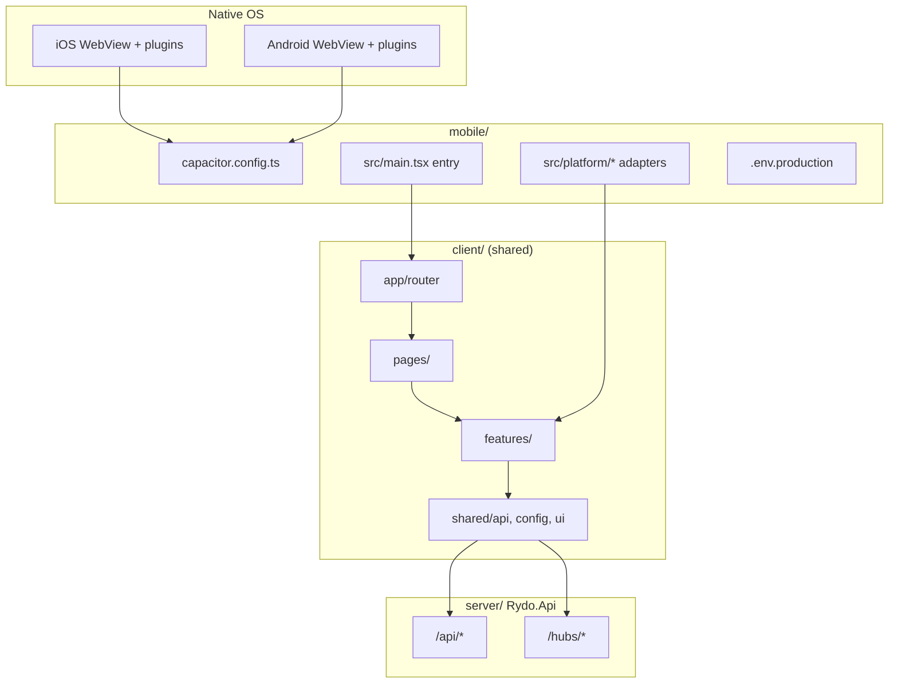
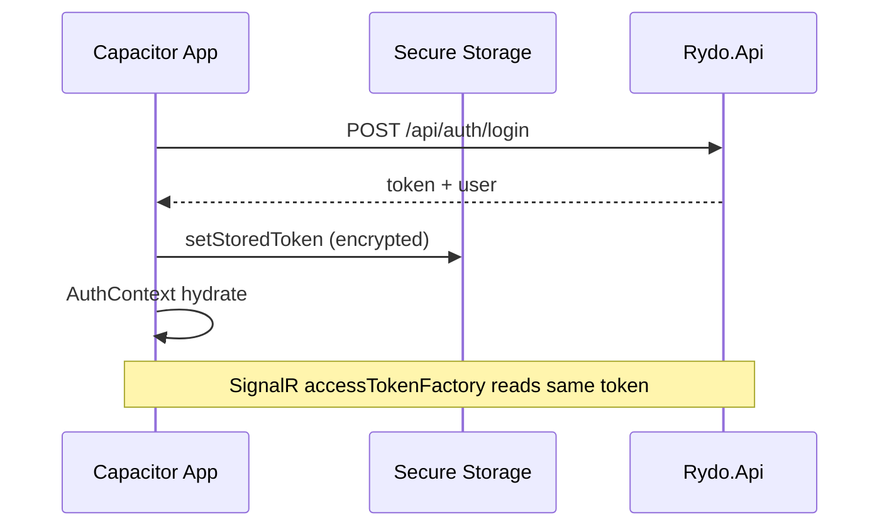

# RYDO Capacitor App — Build Plan

> **Last updated:** 2026-05-29  
> **Owner:** —  
> **Goal:** Ship all existing RYDO product features in iOS and Android apps using Capacitor, with a dedicated `mobile/` directory, minimal duplication, and explicit platform adapters where the browser APIs are insufficient.  
> **Phase 0 scaffold:** Done — see [`README.md`](./README.md) for `npm run run:android`.

---

## Status legend

| Symbol | Meaning |
|--------|---------|
| ⬜ `pending` | Not started |
| 🟡 `in_progress` | Active work |
| ✅ `done` | Complete and verified |
| 🚫 `blocked` | Waiting on dependency or decision |
| ⏸ `deferred` | Out of MVP scope; documented |

Update the **Status** column in tables as work proceeds. Phase gates should not advance until critical-path items for that phase are ✅.

---

## Executive summary

| Area | Assessment |
|------|------------|
| **Backend** | No migration required. REST under `/api`, SignalR at `/hubs/ride-live` and `/hubs/club-chat`, JWT auth — already app-friendly. |
| **UI / domain** | ~320 TS/JS files in `client/src` — **copy via import alias**, not a manual fork. |
| **Rewrite surface** | Thin **platform layer** in `mobile/src/platform/` (~15–25 modules): storage, geolocation, orientation, files, camera, deep links, app lifecycle, safe areas. |
| **Highest risk** | Live ride **background GPS**, Mapbox in WebView performance, store privacy compliance. |
| **Rough timeline** | MVP (auth + core routes + live ride foreground): **6–8 weeks** · Full parity + store polish: **10–14 weeks** (one experienced dev) |

---

## Architectural design

### Principles

1. **Single source of truth** — `client/src` remains canonical for features, pages, hooks, and API mappers.
2. **Host in `mobile/`** — Capacitor config, native projects (`ios/`, `android/`), env templates, and platform adapters only.
3. **Copy what is portable** — React components, TanStack Query, SignalR client, Turf/math, Tailwind styles.
4. **Rewrite at boundaries** — Anything that touches `localStorage`, `navigator.geolocation`, `DeviceOrientationEvent`, file `<input>`, or desktop-only layout assumptions.
5. **No backend schema hacks** — Same rules as [`../.cursor/rules/rydo-database.mdc`](../.cursor/rules/rydo-database.mdc).

### High-level structure



### Target directory layout (to create)

```
mobile/
├── README.md
├── BUILD_PLAN.md                 ← this file
├── package.json                  ← depends on client via workspace or file: link
├── capacitor.config.ts
├── vite.config.ts                ← extends client vite, adds @capacitor aliases
├── index.html
├── .env.example
├── src/
│   ├── main.tsx                  ← Capacitor bootstrap, HashRouter option
│   ├── App.tsx                   ← optional shell overrides
│   └── platform/
│       ├── index.ts              ← registerPlatform() — swaps implementations
│       ├── storage.ts            ← Preferences + secure token
│       ├── geolocation.ts        ← watch/clear; bridges live-ride + near-me
│       ├── orientation.ts        ← compass / heading for live ride
│       ├── files.ts              ← GPX pick + read
│       ├── camera.ts             ← avatar / hazard evidence
│       ├── network.ts            ← reachability hints for hub retry
│       ├── deep-links.ts         ← rydo://ride/:id/live
│       ├── app-lifecycle.ts      ← resume/pause → hub reconnect hooks
│       └── permissions.ts        ← unified permission UX
├── ios/                          ← generated by cap add ios
└── android/                      ← generated by cap add android

client/src/                       ← unchanged canonical tree (imported, not copied file-by-file)
```

### Build & import strategy

| Approach | When | Notes |
|----------|------|-------|
| **Vite alias `@` → `client/src`** | Phase 0–2 | Fastest; `mobile/vite.config` sets `resolve.alias['@']` to `../client/src`. |
| **Optional `@rydo/platform`** | Phase 3+ | If web also needs adapters, move `mobile/src/platform` to `packages/platform` in a pnpm workspace. |
| **Do not** fork `features/live-ride` | Ever | Patch via `platform/geolocation` + `platform/orientation` only. |

### Routing on device

| Option | Pros | Cons | Recommendation |
|--------|------|------|----------------|
| `createBrowserRouter` + `server.url` | Same as web | Needs `capacitor.config` `server` or built assets only | ✅ **Production** — bundle `index.html` + client-side routes |
| `HashRouter` | Zero server rewrite | Ugly URLs | Fallback if deep-link issues |
| Deep links | `rydo://ride/42/live` | Requires `App.addListener('appUrlOpen')` | ✅ Phase 2 |

Capacitor serves static build from `mobile/dist`; all SPA paths must resolve to `index.html` (default Capacitor behavior for bundled apps).

### API & SignalR base URL

| Environment | `VITE_API_BASE_URL` | Hubs |
|-------------|---------------------|------|
| Dev (simulator) | `http://10.0.2.2:5000` (Android) / `http://localhost:5000` (iOS) | `${base}/hubs/...` |
| Dev (device + LAN) | `https://<api-host>` or machine IP | WSS when API is HTTPS |
| Production | `https://<cloudfront-or-alb-domain>` | Same origin as API |

**No Vite dev proxy on device** — set absolute API URL in `mobile/.env.development`.

### Authentication flow



Replace `localStorage` in [`client/src/features/auth/utils/auth-storage.js`](../client/src/features/auth/utils/auth-storage.js) with a **platform storage adapter** injected at startup (web keeps localStorage implementation).

---

## Copy vs rewrite matrix

| Module / path | Action | Mobile notes |
|---------------|--------|--------------|
| `client/src/features/**` (except below) | **Copy** (import) | clubs, rides, routes, account, admin, dashboard, history, challenges, hazards, weather, users, leaderboards |
| `client/src/pages/**` | **Copy** (import) | All routed pages |
| `client/src/shared/**` | **Copy** + thin patches | `api-client` path prefix unchanged (`/api`) |
| `client/src/app/router/**` | **Copy** + extend | Add unrouted pages if product wants parity (history, hazards, challenges, active ride) |
| `client/src/app/styles/**` | **Copy** | Add safe-area env() overrides in `mobile/src/app-overrides.css` |
| `auth-storage.js` | **Rewrite** | Delegate to `platform/storage.ts` |
| `requestLiveRidePermissions.js` | **Rewrite** | Native permission APIs + copy for iOS motion |
| `liveRideCompass.js` | **Rewrite** | `platform/orientation.ts` |
| `useLiveRideMotionFromPositions.js` | **Adapt** | Inject `watchPosition` from `platform/geolocation.ts` |
| `useNearMeGeo.js` | **Adapt** | Same geolocation adapter |
| `useRideLiveHub.js` / `useClubChatHub.js` | **Copy** | Verify WSS + token on device networks |
| `api-client.js` `setAuthToken` | **Adapt** | Stop writing token to localStorage directly |
| GPX upload (`uploadFile`, file input) | **Adapt** | `@capacitor/filesystem` or file-picker plugin |
| `AvatarOrUrlEditor`, hazard uploader | **Adapt** | `@capacitor/camera` |
| `LandingPage` | **Copy** or **Replace** | Optional simplified app splash / skip marketing scroll |
| `lan-https-phone.md` workflow | **N/A** | Replaced by native HTTPS + dev API URL |
| `vite.config` proxy | **N/A** | Not used in Capacitor builds |
| Timelapse / replay Mapbox | **Copy** | Test WebView GPU; may need quality toggles |
| Leaflet route previews | **Copy** | Usually lighter than Mapbox |
| `ActiveRidePage` + navigation | **Copy** + route | Page exists but **not in web router** — add to mobile router |
| Push notifications | **Defer** | Not in current web app |
| Background pose upload | **Rewrite** (Phase 4) | Foreground-only for MVP |

---

## Feature parity checklist

### Legend

- **Web** = shipped in [`client/src/app/router/index.jsx`](../client/src/app/router/index.jsx) today  
- **Code** = implemented under `client/src` but not necessarily routed  
- **Mobile** = target state in Capacitor app  

### Public & auth

| ID | Feature | Web | Code | Mobile target | Status | Notes |
|----|---------|-----|------|---------------|--------|-------|
| A1 | Landing / marketing | ✅ | ✅ | Optional (deep link skip) | ⬜ | Default post-install → login or dashboard |
| A2 | Login | ✅ | ✅ | ✅ | ⬜ | |
| A3 | Register | ✅ | ✅ | ✅ | ⬜ | |
| A4 | JWT persist + refresh behavior | ✅ | ✅ | ✅ | ⬜ | Secure storage adapter |
| A5 | 401 → logout | ✅ | ✅ | ✅ | ⬜ | |

### Dashboard & social

| ID | Feature | Web | Code | Mobile target | Status | Notes |
|----|---------|-----|------|---------------|--------|-------|
| D1 | Dashboard home | ✅ | ✅ | ✅ | ⬜ | |
| D2 | Leaderboards | ✅ | ✅ | ✅ | ⬜ | |
| D3 | Inbox | ✅ | ✅ | ✅ | ⬜ | |
| D4 | User profile (`/users/:id`) | ✅ | ✅ | ✅ | ⬜ | |
| D5 | Friends / friend requests | ✅ | ✅ | ✅ | ⬜ | Via profile + inbox |
| D6 | Settings (profile, prefs, password) | ✅ | ✅ | ✅ | ⬜ | |
| D7 | Theme / color scheme | ✅ | ✅ | ✅ | ⬜ | `ThemeProvider` + system theme |
| D8 | Avatar crop upload | ✅ | ✅ | ✅ | ⬜ | Camera plugin |

### Routes

| ID | Feature | Web | Code | Mobile target | Status | Notes |
|----|---------|-----|------|---------------|--------|-------|
| R1 | Explore routes | ✅ | ✅ | ✅ | ⬜ | |
| R2 | Route details + map preview | ✅ | ✅ | ✅ | ⬜ | Leaflet |
| R3 | Elevation chart | ✅ | ✅ | ✅ | ⬜ | |
| R4 | My routes (uploaded) | ✅ | ✅ | ✅ | ⬜ | |
| R5 | Saved routes | ✅ | ✅ | ✅ | ⬜ | |
| R6 | GPX upload | ✅ | ✅ | ✅ | ⬜ | Native file picker |
| R7 | GPX local parse preview | ✅ | ✅ | ✅ | ⬜ | |
| R8 | Near-me geo filter | ✅ | ✅ | ✅ | ⬜ | Geolocation adapter |
| R9 | Route weather summary | ✅ | ✅ | ✅ | ⬜ | Open-Meteo from ride/route |
| R10 | Rider roster on route | ✅ | ✅ | ✅ | ⬜ | |

### Rides & live

| ID | Feature | Web | Code | Mobile target | Status | Notes |
|----|---------|-----|------|---------------|--------|-------|
| L1 | My rides (upcoming / history tabs) | ✅ | ✅ | ✅ | ⬜ | |
| L2 | Ride event detail | ✅ | ✅ | ✅ | ⬜ | |
| L3 | Join / leave ride | ✅ | ✅ | ✅ | ⬜ | |
| L4 | Create / edit ride modals | ✅ | ✅ | ✅ | ⬜ | |
| L5 | **Live ride map** | ✅ | ✅ | ✅ | ⬜ | Mapbox + SignalR — critical path |
| L6 | Live ride boot gate + permissions | ✅ | ✅ | ✅ | ⬜ | Native prompts |
| L7 | Live ride peer avatars + hub chip | ✅ | ✅ | ✅ | ⬜ | |
| L8 | Club chat on live map | ✅ | ✅ | ✅ | ⬜ | Scoped hub |
| L9 | Live ride replay (`/live`) | ✅ | ✅ | ✅ | ⬜ | QA tool; lower priority |
| L10 | Active ride navigation page | ❌ | ✅ | ✅ | ⬜ | Add route; `useLiveLocation` stub → real GPS later |
| L11 | Offline route cache banner | ❌ | ✅ | ⏸ | ⏸ | Defer unless needed |

### Clubs & chat

| ID | Feature | Web | Code | Mobile target | Status | Notes |
|----|---------|-----|------|---------------|--------|-------|
| C1 | Clubs list | ✅ | ✅ | ✅ | ⬜ | |
| C2 | Club detail | ✅ | ✅ | ✅ | ⬜ | |
| C3 | Club settings / membership | ✅ | ✅ | ✅ | ⬜ | |
| C4 | Club chat dock (global) | ✅ | ✅ | ✅ | ⬜ | SignalR `club-chat` |
| C5 | Club join requests realtime | ✅ | ✅ | ✅ | ⬜ | |

### History, challenges, hazards

| ID | Feature | Web | Code | Mobile target | Status | Notes |
|----|---------|-----|------|---------------|--------|-------|
| H1 | Ride history (standalone page) | ❌ | ✅ | ✅ | ⬜ | Embedded in My Rides on web; add nav or keep tab |
| H2 | History cards + map preview | ❌ | ✅ | ✅ | ⬜ | |
| CH1 | Challenges page | ❌ | ✅ | ✅ | ⬜ | Dashboard also fetches challenges |
| CH2 | Achievements / progress ring | ❌ | ✅ | ✅ | ⬜ | |
| HZ1 | Hazards list + report | ❌ | ✅ | ✅ | ⬜ | Add route + tab if desired |
| HZ2 | Hazard evidence upload | ❌ | ✅ | ✅ | ⬜ | Camera |

### Admin

| ID | Feature | Web | Code | Mobile target | Status | Notes |
|----|---------|-----|------|---------------|--------|-------|
| AD1 | Admin dashboard | ✅ | ✅ | ⬜ | ⏸ | Optional on phone; tablet OK |
| AD2 | Admin users | ✅ | ✅ | ⬜ | ⏸ | |
| AD3 | Admin routes moderation | ✅ | ✅ | ⬜ | ⏸ | |
| AD4 | Admin hazards | ✅ | ✅ | ⬜ | ⏸ | |

### Tools

| ID | Feature | Web | Code | Mobile target | Status | Notes |
|----|---------|-----|------|---------------|--------|-------|
| T1 | Timelapse tool | ✅ | ✅ | ⏸ | ⏸ | Desktop-oriented; low mobile priority |
| T2 | Mock API mode | ✅ | ✅ | ⬜ | Dev only | Disable in store builds |

---

## Capacitor plugins & native capabilities

| Capability | Plugin / API | Used by | Status |
|------------|--------------|---------|--------|
| Core runtime | `@capacitor/core` | All | ⬜ |
| App lifecycle | `@capacitor/app` | Hub reconnect, deep links | ⬜ |
| Status bar / splash | `@capacitor/status-bar`, `@capacitor/splash-screen` | Polish | ⬜ |
| Keyboard | `@capacitor/keyboard` | Chat composer, forms | ⬜ |
| Haptics | `@capacitor/haptics` | Optional live-ride feedback | ⏸ |
| Geolocation (foreground) | `@capacitor/geolocation` | Live ride, near-me | ⬜ |
| Background geolocation | `@capacitor-community/background-geolocation` or equivalent | Lock-screen riding | ⏸ Phase 4 |
| Preferences | `@capacitor/preferences` | Non-sensitive prefs | ⬜ |
| Secure storage | `@capacitor-community/secure-storage` or similar | JWT | ⬜ |
| Camera | `@capacitor/camera` | Avatar, hazards | ⬜ |
| Filesystem / picker | `@capacitor/filesystem` + file picker | GPX upload | ⬜ |
| Network | `@capacitor/network` | Offline hub chip messaging | ⬜ |
| Motion / orientation | `@capacitor/motion` or DeviceOrientation bridge | Live ride heading | ⬜ |
| Keep awake | `@capacitor-community/keep-awake` | Optional during live ride | ⏸ |
| Push | `@capacitor/push-notifications` | Future | ⏸ |

### iOS `Info.plist` / Android manifest (required strings)

| Permission | iOS key | Android | Feature |
|------------|---------|---------|---------|
| Location when in use | `NSLocationWhenInUseUsageDescription` | `ACCESS_FINE_LOCATION` | Live ride, near-me |
| Location always | `NSLocationAlwaysAndWhenInUseUsageDescription` | `ACCESS_BACKGROUND_LOCATION` | Phase 4 only |
| Motion | `NSMotionUsageDescription` | `HIGH_SAMPLING_RATE_SENSORS` if needed | Compass heading |
| Camera | `NSCameraUsageDescription` | `CAMERA` | Avatar, hazards |
| Photo library | `NSPhotoLibraryUsageDescription` | `READ_MEDIA_*` | Pick existing photos |

---

## Phased implementation

### Phase 0 — Scaffold & toolchain

**Exit criteria:** `npm run build` in `mobile/` produces `dist/`; `npx cap sync` opens in Xcode/Android Studio simulator; login hits real API.

| ID | Task | Status | Owner |
|----|------|--------|-------|
| 0.1 | Create `mobile/package.json` with Capacitor 7+, Vite 8, React 19 aligned with `client/` | ✅ | |
| 0.2 | Add `capacitor.config.ts` (`appId`, `appName`, `webDir: dist`, cleartext) | ✅ | |
| 0.3 | Vite config: alias `@` → `../client/src`, env dir `mobile/` | ✅ | |
| 0.4 | `mobile/src/main.jsx` — loads client app + Capacitor platform class | ✅ | |
| 0.5 | `npx cap add android` (iOS: `cap add ios` on Mac) | ✅ android / ⬜ ios | |
| 0.6 | Emulator env templates + `npm run env:ios` / `env:android` (see `mobile/README.md`) | ✅ | |
| 0.7 | npm scripts: `build`, `run:android`, `check:android`, `cap:*` | ✅ | |
| 0.8 | Document dev API URLs for emulator vs physical device in `mobile/README.md` | ✅ | |
| 0.9 | CI job: `mobile` build only (no store deploy yet) | ⬜ | |

### Phase 1 — Platform adapters (rewrite layer)

**Exit criteria:** Auth token survives app restart; geolocation watch feeds a test screen; GPX file can be read from picker.

| ID | Task | Status | Owner |
|----|------|--------|-------|
| 1.1 | Define `PlatformServices` interface in `mobile/src/platform/types.ts` | ⬜ | |
| 1.2 | Implement `storage.ts` (web fallback + native secure token) | ⬜ | |
| 1.3 | Patch `auth-storage.js` to use injected storage (no fork — env flag or DI) | ⬜ | |
| 1.4 | Implement `geolocation.ts` (`watchPosition`, `clearWatch`, permission status) | ⬜ | |
| 1.5 | Refactor `useLiveRideMotionFromPositions` to accept geolocation provider | ⬜ | |
| 1.6 | Implement `orientation.ts` + refactor `liveRideCompass.js` / permissions | ⬜ | |
| 1.7 | Implement `files.ts` for GPX pick; wire upload modals | ⬜ | |
| 1.8 | Implement `camera.ts` for avatar + hazard evidence | ⬜ | |
| 1.9 | Implement `app-lifecycle.ts` — emit resume/pause for hub hooks | ⬜ | |
| 1.10 | Safe area CSS overrides + test on notched devices | ⬜ | |

### Phase 2 — Core product parity (routed features)

**Exit criteria:** All ✅ rows in Public, Dashboard, Routes, Rides (except L10), Clubs tables work on device against staging API.

| ID | Task | Status | Owner |
|----|------|--------|-------|
| 2.1 | Import existing router; verify every **Web ✅** route renders | ⬜ | |
| 2.2 | Replace mobile landing default: authenticated → dashboard | ⬜ | |
| 2.3 | Mobile layout polish: bottom nav safe area, hide desktop-only sidebars | ⬜ | |
| 2.4 | Mapbox token in mobile env; verify live ride + route previews | ⬜ | |
| 2.5 | SignalR ride-live: connect, join, pose, reconnect after airplane mode | ⬜ | |
| 2.6 | SignalR club-chat: dock + live map scoped chat | ⬜ | |
| 2.7 | GPX upload end-to-end on device | ⬜ | |
| 2.8 | Ride event → Live map navigation + boot gate | ⬜ | |
| 2.9 | Add routes for **Code-only** pages: history, challenges, hazards (product decision) | ⬜ | |
| 2.10 | Deep link: `rydo://ride/{id}/live`, `rydo://ride/{id}` | ⬜ | |
| 2.11 | Tablet layout smoke test (optional admin) | ⬜ | |

### Phase 3 — Live ride hardening

**Exit criteria:** 30+ minute ride test with screen lock **either** keeps publishing (Phase 4) **or** clear UX when backgrounded (MVP).

| ID | Task | Status | Owner |
|----|------|--------|-------|
| 3.1 | Foreground live ride soak test (GPS drift, hub stale peers) | ⬜ | |
| 3.2 | `KeepAwake` optional toggle in live ride settings | ⏸ | |
| 3.3 | App background → hub reconnect + `JoinRide` (visibility handler → Capacitor `appStateChange`) | ⬜ | |
| 3.4 | Mapbox WebView memory / crash monitoring | ⬜ | |
| 3.5 | Battery / GPS accuracy logging (`rideLiveLog` on device builds) | ⬜ | |
| 3.6 | Production WSS through CloudFront/ALB (verify infra websocket support) | ⬜ | |

### Phase 4 — Background & store (deferred items)

| ID | Task | Status | Owner |
|----|------|--------|-------|
| 4.1 | Background geolocation + Android foreground service notification | ⏸ | |
| 4.2 | iOS background location capability + App Store review notes | ⏸ | |
| 4.3 | Push notifications (ride reminders) | ⏸ | |
| 4.4 | App Store / Play Console listings, screenshots, privacy nutrition | ⏸ | |
| 4.5 | Mapbox mobile SDK attribution compliance in native wrapper | ⏸ | |
| 4.6 | Admin screens on tablet | ⏸ | |

---

## Client patches (minimal diff to `client/`)

Prefer **injection** over branching:

```ts
// mobile/src/platform/register.ts
import { setPlatformStorage } from '@/features/auth/utils/auth-storage';
import { setGeolocationProvider } from '@/features/live-ride/platform/geolocation-provider';
import { nativeStorage } from './storage';
import { nativeGeolocation } from './geolocation';

export function registerPlatform() {
  setPlatformStorage(nativeStorage);
  setGeolocationProvider(nativeGeolocation);
}
```

| File to touch | Change |
|---------------|--------|
| `auth-storage.js` | Add optional `platformStorage` delegate; default `localStorage` |
| `useLiveRideMotionFromPositions.js` | Read positions from provider interface |
| `requestLiveRidePermissions.js` | Call `platform/permissions.ts` on native |
| `env.js` | `isNativeApp` flag via `import.meta.env.VITE_PLATFORM=native` |
| `useRideLiveHub.js` | Optional: use `appStateChange` instead of `visibilitychange` when native |

Keep patches **< 200 lines total** in `client/`; everything else stays in `mobile/src/platform/`.

---

## Environment variables

| Variable | Required | Description |
|----------|----------|-------------|
| `VITE_API_MODE` | Yes | `real` for device builds; `mock` dev-only |
| `VITE_API_BASE_URL` | Yes (mobile) | Absolute API origin, e.g. `https://app.rydo.example` |
| `VITE_MAPBOX_ACCESS_TOKEN` | Yes | Mapbox GL |
| `VITE_PLATFORM` | Yes | `native` \| `web` — toggles adapters |
| `VITE_LOG_RIDE_LIVE` | No | Debug logging on device |
| `VITE_DEV_AUTH_ENABLED` | No | **Must be false** in store builds |

---

## Testing strategy

| Layer | What | Status |
|-------|------|--------|
| Unit | Platform adapters (mock Capacitor bridge) | ⬜ |
| Integration | Login → join ride → live map pose round-trip | ⬜ |
| Device | iOS simulator + one physical iPhone | ⬜ |
| Device | Android emulator + one physical device | ⬜ |
| Network | Airplane mode ↔ hub reconnect | ⬜ |
| Ride soak | 30 min live ride, screen on | ⬜ |
| Store | TestFlight / internal testing track | ⏸ |

Existing Playwright a11y tests remain **web-only** (`client/tests/a11y`). Add Detox or Maestro later if needed — ⏸ deferred.

---

## Infrastructure checklist (no code changes required for MVP)

| Item | Verify | Status |
|------|--------|--------|
| ALB / CloudFront allows **WebSocket** upgrade to `/hubs/*` | ⬜ | |
| CORS allows `capacitor://localhost` or `https://localhost` origin if needed | ⬜ | |
| JWT works with SignalR `accessTokenFactory` from mobile | ⬜ | |
| Mapbox token restricted by bundle ID / URL (separate mobile public token) | ⬜ | |

---

## Risks & mitigations

| Risk | Impact | Mitigation |
|------|--------|------------|
| Mapbox GL heavy in WebView | Crashes, heat | Reduce pitch/zoom effects; lazy-load map chunk (already done in `LiveRideRoute`) |
| iOS kills WebView in background | Stops pose upload | Phase 3 UX warning; Phase 4 background plugin |
| Secure storage plugin maturity | Token loss | Fallback Preferences + migrate on launch |
| Fork drift if copying files | Maintenance | **Only** alias imports; never duplicate `features/` |
| Admin on small screens | Poor UX | Defer or tablet-only |

---

## Decisions log

| Date | Decision | Rationale |
|------|----------|-----------|
| 2026-05-29 | Capacitor host in `mobile/`, shared `client/src` | User request; minimizes rewrite |
| 2026-05-29 | Foreground-only live ride for MVP | Store compliance complexity |
| 2026-05-29 | Admin deferred on phone | Low mobile admin usage |

---

## Progress summary

| Phase | Total tasks | Done | % |
|-------|-------------|------|---|
| Phase 0 | 9 | 0 | 0% |
| Phase 1 | 10 | 0 | 0% |
| Phase 2 | 11 | 0 | 0% |
| Phase 3 | 6 | 0 | 0% |
| Phase 4 | 6 | 0 | 0% |
| **Feature parity items** | **48** | **0** | **0%** |

---

## Related docs

- [client/README.md](../client/README.md) — web architecture & API contracts  
- [client/docs/live-ride-map-position.md](../client/docs/live-ride-map-position.md) — GPS / hub behavior (still applies)  
- [client/docs/lan-https-phone.md](../client/docs/lan-https-phone.md) — web-only; not used for Capacitor prod  
- [README.md](../README.md) — Docker DB recreate policy when pulling schema changes  

---

## Next action

Start **Phase 0.1–0.5**: scaffold `mobile/package.json`, Capacitor config, and Vite alias to `client/src` so the existing login screen loads in the iOS simulator.
